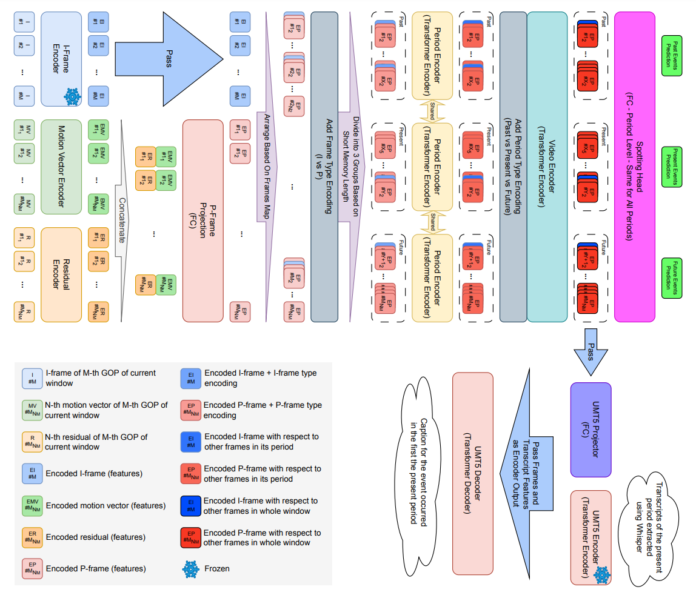

# CVT5
Official Implementation of CVT5: Using Compressed Video Encoder and UMT5 for Dense Video Captioning (EvalMG25 @ COLING 2025)

## Architecture Overview



## Checkpoint

We have released the best checkpoint trained on train+validation+test. You can submit the predictions of this checkpoint to the (eval.ai platform)[https://eval.ai/web/challenges/challenge-page/2199/overview] challenge phase to compare results with SOTA methods. To download and extract the checkpoint, use the following command:

```bash
bash download_checkpoint.sh
```

## How to train and evaluate

### Install Requirements

*Note: It is highly recommended to create a virtual environment and install the requirements in the environment!*

First follow the instructions on the [Compressed Video Reader Repo](https://github.com/acherstyx/Compressed-Video-Reader) to install ffmpeg patch and the compressed video reader.

Then run the following command to install the rest of requirements:

```bash
pip instal -r requirements.txt
```

### Download SoccerNet DVC dataset

Run the following command to download the dense video captioning dataset. You have to pass the ```--base_dir``` argument and after running the command you will be prompted to enter the SoccerNet dataset password. You have to fill [this form](https://docs.google.com/forms/d/e/1FAIpQLSfYFqjZNm4IgwGnyJXDPk2Ko_lZcbVtYX73w5lf6din5nxfmA/viewform) to receive the password from the organizers.

```bash
python prepare_data\download_data.py --base_dir [BASE_DIR]
```

### Preprocess videos

We preprocess videos to use H.264 codec, enforce the use of P-frames only, set a resolution of 224x224, and the sampling rate of 2 fps.

To apply these preprocessing steps, run the following command:

```bash
python prepare_data\preprocess_videos.py --base_dir [BASE_DIR]
```

*Note: If you want to use a fixed GOP size or a different target fps you can pass ```--gop_size``` and ```--target_fps``` respectively.*

### Extract I and P-Frames

To extract and save the I and P-frames, run the following command:

```bash
python prepare_data/extract_frames.py --base_dir [BASE_DIR]
```

*Note: If you have passed the ```--gop_size``` argument to the preprocessing script, you must pass the same value to this script as well.*

### Extract I-Frames Features

We use a frozen encoder to extract features from I-frames. You can use the following command to extract the features:

```bash
python prepare_data\extract_I_features.py --base_dir [BASE_DIR]
```

This script uses the vision transformer of the ```openai/clip-vit-base-patch32```, you can specify ```--feature_extractor resnet``` to use ResNet-152 instead. Also, there is another optional argument named ```--batch_size``` to control the batch size (default=32).

*Note: If you have passed the ```--gop_size``` argument to the preprocessing script, you have to pass the same value to this script as well.*

### Extract RGB Frames Features (Optional)

If you want to compare the results with RGB counterpart, you have to extract features from RGB frames. To this end, run the following command:

```bash
python prepare_data\extract_rgb_features.py --base_dir [BASE_DIR]
```

There is an optional argument named ```--batch_size``` to control the batch size (default=32).

### Extract transcripts features

We use ```openai/whisper-large-v3``` followed by the encoder part of ```google/umt5-base``` to extract the features from each chunk of the videos. To this end, first run the following command to perform ASR and extract video transcripts:

```bash
python prepare_data\asr.py --base_dir [BASE_DIR]
```

There is an optional argument named ```--asr_batch_size``` to control the batch size (default=32).

Then run the following command to extract the features:

```bash
python prepare_data\extract_asr_features.py --base_dir [BASE_DIR]
```

*Note: If you want to train the model using an arbitrary short memory length (default=60), you have to specify the ```chunk_size_s``` argument (default=30). Keep in mind that this argument is in seconds, so you have to pass the ```short_memory_length / fps``` to it.*

### Train the model

To train the model you have to create a ```.json``` file nder the ```configs``` directory (```rgb_configs``` for RGB videos). You can find the configs we have used for different settings under these directories.

*Note: Please update the directories in the config files.*

Then run the following command to train the model using compressed videos:

```bash
python train.py --config [CONFIG_FILE_NAME]
```

Then run the following command to train the model using RGB videos:

```bash
python rgb_train.py --config [CONFIG_FILE_NAME]
```

### Evaluation and prediction

Run the following command to make predictions using compressed videos:

```bash
python predict_dvc.py --model [PATH_TO_MODEL_CHECKPOINT]
```

and the following command to do make predictions using RGB videos:

```bash
python rgb_predict_dvc.py --model [PATH_TO_MODEL_CHECKPOINT]
```

*Note: If you want to do evaluate on the test set specified in the config file at the end of prediction, pass ```--evaluate``` to these scripts. Note that you cannot pass it when the test set is "challenge".*

There are a bunch of arguments to control the generation method. You can check them in the script.

## Performace Comparison

Please refer to [this repo](https://github.com/mohammadjavadpirhadi/CVT5-Performance).

